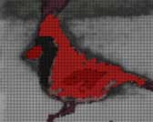

***

{width=150px}

_Cardinal_ is an R package designed for efficient analysis of mass spectrometry-based imaging experiments. The capabilities include visualization of single and composite ion images, pre-processing (normalization, spectral smoothing, baseline reduction, peak picking, peak filtering, and peak alignment), as well as traditional and novel supervised and unsupervised methods such as image segmentation (clustering/classification), principle components analysis (PCA), and partial least squares discriminant analysis (PLS-DA).

_Cardinal_ was awarded the 2015 John M. Chambers Statistical Software Award by the American Statistical Association.

- Webite: http://cardinalmsi.org/
- Bioconductor: http://bioconductor.org/packages/Cardinal/
- Github: https://github.com/kuwisdelu/Cardinal

{width=150px}

_matter_ is an R package designed for rapid prototyping of new statistical methods when working with larger-than-memory datasets on disk. Unlike related packages _bigmemory_ and _ff_, which also work with file-backed larger-than-memory datasets, _matter_ aims to offer strict control over memory and maximum flexibility with file-based data structures, so it can be easily adapted to domain-specific file formats, including user-customized file formats.

- Article: [R Consortium-Funded R Package “matter” Helps Solve Larger-Than-Memory Issues](https://www.r-consortium.org/blog/2023/05/24/matter-helps-solve-larger-than-memory-issues)
- Article: [Improving with R: Kylie Bemis Unveils Enhanced Signal Processing with Matter 2.4 Upgrade](https://www.r-consortium.org/blog/2024/02/07/improving-with-r-kylie-bemis-unveils-enhanced-signal-processing-with-matter-2-4-upgrade)
- Bioconductor: http://bioconductor.org/packages/matter/
- Github: https://github.com/kuwisdelu/matter
